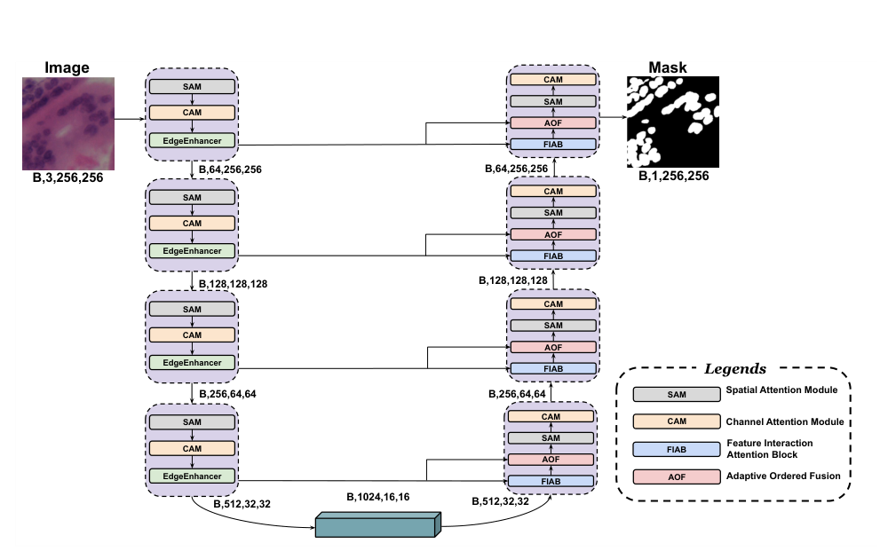

# FIFA-UNet

**Feature Interaction and Fusion in Attention-based U-Net for
Histopathological Nuclei Segmentation**

FIFA-UNet is a U-Net-based deep learning framework for **binary nuclei
segmentation in histopathology images**. The architecture combines
channel and spatial attention, explicit edge enhancement, decoder-guided
feature interaction, and adaptive ordered feature fusion to improve
boundary delineation and multi-scale feature integration.

> **Paper:** *FIFA-UNet: Feature Interaction and Fusion in
> Attention-based UNet for Histopathological Nuclei Segmentation in
> Histopathology Images*\
> **Authors:** Sayan Mukherjee, Gouranga Maity, Ram Sarkar\
> **Affiliation:** Department of Computer Science and Engineering,
> Jadavpur University, Kolkata, India

------------------------------------------------------------------------

## Overview

Accurate nuclei segmentation is an important component of computational
pathology. Histopathology images often contain nuclei with large
variations in shape, size, staining, texture, and boundary contrast.
Closely packed or overlapping nuclei and differences between datasets
further complicate pixel-level segmentation.

FIFA-UNet addresses these challenges by extending the conventional U-Net
architecture with four main components:

-   **Channel Attention Module (CAM)** --- recalibrates feature channels
    according to their learned importance.
-   **Spatial Attention Module (SAM)** --- emphasizes informative
    spatial regions and boundaries.
-   **Edge Enhancer (EE)** --- extracts and amplifies high-frequency
    boundary information.
-   **Feature Interaction Attention Block (FIAB)** --- uses decoder
    features to query relevant encoder features and reduce the
    encoder-decoder semantic gap.
-   **Adaptive Ordered Fusion (AOF)** --- performs rank-based,
    non-linear fusion of encoder and decoder features using spatially
    adaptive gates.

The model performs **semantic/binary segmentation**, producing a single
foreground-background mask. It does not assign separate instance
identities to touching nuclei.

------------------------------------------------------------------------

## Architecture

The overall FIFA-UNet architecture follows the network proposed in the paper, combining a U-Net encoder-decoder with **Spatial Attention Module (SAM), Channel Attention Module (CAM), Edge Enhancer, Feature Interaction Attention Block (FIAB), and Adaptive Ordered Fusion (AOF)**.

### Overall Architecture



*Figure: Overall architecture of FIFA-UNet.*

The encoder progressively extracts features at multiple resolutions using CAM, SAM, and the Edge Enhancer. The decoder reconstructs the segmentation mask while using FIAB and AOF to align and fuse encoder and decoder features.

## Key Modules

### 1. Channel Attention Module (CAM)

CAM performs global average pooling followed by two `1 × 1` convolutions
and nonlinear activations to generate channel-wise attention weights.

Conceptually:

``` text
Feature Map
    ↓
Global Average Pooling
    ↓
1×1 Conv → ReLU → 1×1 Conv → Sigmoid
    ↓
Channel Attention Weights
    ↓
Feature Recalibration
```

This allows the network to emphasize informative feature channels and
suppress less relevant responses.

### 2. Spatial Attention Module (SAM)

SAM complements CAM by modeling spatial relationships. Mean and max
pooling are applied along the channel dimension, followed by a `7 × 7`
convolution and sigmoid activation.

``` text
CAM Output
    ├── Mean Pool ──┐
    └── Max Pool ───┤
                    ↓
                Concatenate
                    ↓
                 7×7 Conv
                    ↓
                 Sigmoid
                    ↓
             Spatial Attention
```

### 3. Edge Enhancer

The Edge Enhancer explicitly extracts high-frequency information:

``` text
F_edge = E - AvgPool(E)
F_out  = E + Conv(F_edge)
```

The low-frequency average-pooled representation is subtracted from the
original feature map to isolate local high-frequency structures. A
learnable `3 × 3` convolution then refines these edge features.

This module is placed after each encoder stage to preserve boundary
information that may otherwise be degraded by repeated downsampling.

### 4. Feature Interaction Attention Block (FIAB)

FIAB addresses the semantic mismatch between shallow encoder
representations and deeper decoder representations.

The upsampled decoder feature acts as:

-   **Query (Q)**

while the encoder feature provides:

-   **Key (K)**
-   **Value (V)**

The block computes an attention relationship between the decoder and
encoder representations and adds the attended encoder information back
to the decoder stream.

``` text
Decoder → Query (Q)
Encoder → Key (K)
Encoder → Value (V)

Q + K
  ↓
Softmax Attention
  ↓
Attention × V
  ↓
Decoder Feature + Attended Encoder Feature
```

Unlike a conventional additive attention gate, FIAB performs
cross-attention between the two feature streams.

### 5. Adaptive Ordered Fusion (AOF)

AOF performs non-linear, rank-based feature fusion.

At each spatial location, encoder and decoder activations are treated as
an unordered pair and sorted:

``` text
Encoder ─┐
         ├── Stack → Sort → [x(1), x(2)]
Decoder ─┘
```

A gating network generates adaptive weights:

``` text
[G1, G2] = Sigmoid(Conv(ReLU(Conv(Encoder ⊕ Decoder))))
```

The fused representation is then:

``` text
F_AOF = G1 · x(1) + G2 · x(2)
```

This allows the model to adaptively weight the locally weaker or
stronger activation based on its rank rather than simply relying on
fixed encoder/decoder ordering.

------------------------------------------------------------------------

## Training Configuration

The experimental configuration reported in the paper is:

  Parameter       Value
  --------------- --------------------------
  Input size      `256 × 256`
  Batch size      `4`
  Epochs          `200`
  Optimizer       Adam
  Learning rate   `1 × 10⁻⁵`
  Loss            BCE + Dice
  Random seed     `42`
  Framework       PyTorch
  GPU             NVIDIA Tesla P100, 16 GB

All images were resized to `256 × 256` and pixel intensities were scaled
to `[0, 1]`. No channel-wise mean/std normalization was applied.

Training-only augmentation:

-   Horizontal flip: `p = 0.5`
-   Vertical flip: `p = 0.3`
-   Random 90° rotation: `p = 0.5`
-   Shift-scale-rotate:
    -   Shift limit: `0.05`
    -   Scale limit: `0.05`
    -   Rotation limit: `15°`
    -   Probability: `0.5`

No augmentation was applied to validation or test data.

------------------------------------------------------------------------

## Loss Function

FIFA-UNet uses a hybrid **Binary Cross-Entropy + Dice loss**.

The BCE component supports pixel-level probabilistic learning, while
Dice loss encourages region-level overlap and helps address
foreground-background imbalance.

``` text
Total Loss = BCE Loss + Dice Loss
```

------------------------------------------------------------------------

## Datasets

The experiments were conducted on three publicly available
histopathology datasets.

### MoNuSeg

-   Histopathology images from multiple organs.
-   H&E stained.
-   Images acquired at 40× magnification.
-   Training subset: 30 images of `1000 × 1000` pixels.
-   Training/validation split: 80% / 20%.
-   More than 20,000 manually annotated nuclei.
-   Test subset: 14 images from seven organs.

### TNBC

-   H&E stained histopathology images from triple-negative breast
    cancer.
-   50 patches of `512 × 512` pixels.
-   Acquired at 40× magnification.
-   4,022 manually annotated nuclei.
-   Stratified split:
    -   70% training
    -   10% validation
    -   20% testing

### NuInsSeg

-   665 histopathology images.
-   More than 30,000 manually annotated nuclei.
-   31 human and mouse tissue types.
-   Image size: `512 × 512`.
-   Acquired at 40× magnification.
-   Split:
    -   70% training
    -   20% validation
    -   10% testing

> Dataset files are not included in this repository. Please obtain the
> datasets from their respective official sources and follow their
> licenses and usage conditions.

------------------------------------------------------------------------

## Evaluation Metrics

The model is evaluated using:

### Dice Score

``` text
Dice = 2|X ∩ Y| / (|X| + |Y|)
```

### Intersection over Union (IoU)

``` text
IoU = |X ∩ Y| / |X ∪ Y|
```

Both metrics evaluate overlap between the predicted binary segmentation
mask and the ground-truth mask.

------------------------------------------------------------------------

## Results

Reported performance from the paper:

  Dataset           Dice (%)     IoU (%)
  -------------- ----------- -----------
  **MoNuSeg**      **80.83**   **67.89**
  **TNBC**         **84.57**   **73.28**
  **NuInsSeg**     **82.80**   **71.49**

### Model Complexity

  Property                            Value
  ------------------------ ----------------
  Trainable parameters               33.2 M
  Model size (FP32)             \~126.77 MB
  Computational cost          120.18 GFLOPs
  Average inference time     75.94 ms/image
  Throughput                 13.17 images/s

The reported inference measurements were obtained using PyTorch on an
NVIDIA Tesla P100 16 GB GPU in the Kaggle computational environment.

------------------------------------------------------------------------

## Ablation Study

The paper evaluates progressively enhanced versions of the architecture:

  Variant                    MoNuSeg Dice   TNBC Dice   NuInsSeg Dice
  ------------------------ -------------- ----------- ---------------
  U-Net                             78.97       83.43           80.27
  U-Net + Edge Enhancer             80.53       82.94           79.84
  U-Net + EE + SAM                  80.33       83.58           78.42
  U-Net + EE + SAM + CAM            80.09       83.94           80.24
  Full model + FIAB             **80.83**   **84.57**       **82.80**

Corresponding IoU values are reported in the paper's ablation table.

------------------------------------------------------------------------

## Cross-Dataset Evaluation

The paper also reports direct cross-dataset evaluation without
fine-tuning:

  Train → Test             Dice      IoU
  -------------------- -------- --------
  TNBC → MoNuSeg         0.5919   0.4275
  TNBC → NuInsSeg        0.3856   0.2492
  MoNuSeg → TNBC         0.7864   0.6482
  MoNuSeg → NuInsSeg     0.4110   0.2798
  NuInsSeg → MoNuSeg     0.0170   0.0086
  NuInsSeg → TNBC        0.0476   0.0247

These results show that transfer performance is direction-dependent and
that substantial domain differences can affect generalization.

------------------------------------------------------------------------

## Repository Structure

The repository contains the final FIFA-UNet implementations for the three evaluated datasets:

```text
FIFA-UNet/
├── monuseg-bin-seg-aof-fiab-finalmodel.ipynb
├── nuinsseg-bin-segmentation.ipynb
└── tnbc-bin-seg-aof-fiab-finalmodel.ipynb
```

### Notebooks

- `monuseg-bin-seg-aof-fiab-finalmodel.ipynb` — Final FIFA-UNet binary segmentation implementation for **MoNuSeg**.
- `nuinsseg-bin-segmentation.ipynb` — Final FIFA-UNet binary segmentation implementation for **NuInsSeg**.
- `tnbc-bin-seg-aof-fiab-finalmodel.ipynb` — Final FIFA-UNet binary segmentation implementation for **TNBC**.

Only the final codes for these three datasets are provided in this repository.

## Installation

Create a Python environment and install the required dependencies:

``` bash
git clone <YOUR-REPOSITORY-URL>
cd FIFA-UNet

python -m venv .venv
source .venv/bin/activate   # Linux/macOS
# .venv\Scripts\activate    # Windows

pip install -r requirements.txt
```

A typical `requirements.txt` for a PyTorch implementation may contain:

``` text
torch
torchvision
numpy
opencv-python
Pillow
scikit-learn
albumentations
matplotlib
tqdm
```

> Exact dependency versions should be pinned to the versions used by the
> implementation when the repository is finalized.

------------------------------------------------------------------------

## Dataset Preparation

After downloading the datasets, organize them according to the dataset
loader used by the repository.

Example:

``` text
data/
├── MoNuSeg/
│   ├── images/
│   └── masks/
├── TNBC/
│   ├── images/
│   └── masks/
└── NuInsSeg/
    ├── images/
    └── masks/
```

The model expects RGB input images and binary nuclei masks.

------------------------------------------------------------------------

## Training

Example command:

``` bash
python train.py \
    --dataset monuseg \
    --img-size 256 \
    --batch-size 4 \
    --epochs 200 \
    --lr 1e-4 \
    --seed 42
```

For TNBC:

``` bash
python train.py \
    --dataset tnbc \
    --img-size 256 \
    --batch-size 4 \
    --epochs 200 \
    --lr 1e-4 \
    --seed 42
```

For NuInsSeg:

``` bash
python train.py \
    --dataset nuinsseg \
    --img-size 256 \
    --batch-size 4 \
    --epochs 200 \
    --lr 1e-4 \
    --seed 42
```

> The commands above describe the intended training interface. Adjust
> the arguments to match the actual scripts included in the repository.

------------------------------------------------------------------------

## Inference

Example:

``` bash
python inference.py \
    --input path/to/image.png \
    --checkpoint path/to/fifa_unet.pth \
    --output outputs/prediction.png
```

The model produces a binary foreground/background segmentation mask.

------------------------------------------------------------------------

## Reproducibility

The reported experiments use:

-   Fixed random seed: `42`
-   Input resolution: `256 × 256`
-   Adam optimizer
-   Learning rate: `1e-4`
-   Batch size: `4`
-   200 training epochs
-   BCE + Dice loss
-   Training-only augmentation
-   No augmentation during validation/testing

For reproducible results, use the same dataset splits and preprocessing
configuration reported in the paper.

------------------------------------------------------------------------

## Limitations

The paper identifies several limitations:

1.  The additional CAM, SAM, FIAB, and AOF modules increase
    computational overhead.
2.  Inference on high-resolution whole-slide images can therefore be
    relatively expensive.
3.  The approach relies on dense pixel-level annotations.
4.  Performance can decrease in sparsely populated tissue regions with
    severe foreground-background imbalance.
5.  Cross-dataset evaluation shows that generalization is not uniform
    across all dataset pairs.

------------------------------------------------------------------------

## Future Work

The paper identifies the following directions for future research:

-   Semi-supervised and weakly supervised learning to reduce annotation
    requirements.
-   Model compression and architectural optimization for faster
    inference.
-   Domain adaptation to improve generalization across unseen tissue
    types and imaging protocols.

------------------------------------------------------------------------

## Authors

**Sayan Mukherjee**\
Department of Computer Science and Engineering\
Jadavpur University, Kolkata, India

**Gouranga Maity**\
Department of Computer Science and Engineering\
Jadavpur University, Kolkata, India

**Ram Sarkar**\
Department of Computer Science and Engineering\
Jadavpur University, Kolkata, India

------------------------------------------------------------------------

## Acknowledgement

This README is based on the methodology, experimental protocol, results,
and limitations described in the FIFA-UNet manuscript.

## License

No software license is specified in the manuscript. Add a repository
license before distributing the implementation publicly.
